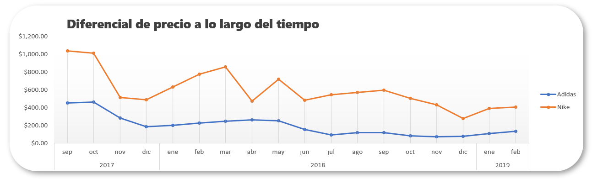

# Proyectos de Análisis de Datos en Excel

Este repositorio contiene varios proyectos de análisis de datos realizados en Excel. Cada proyecto aborda diferentes aspectos del análisis de datos, desde la limpieza de datos hasta la visualización y creación de dashboards.

## Tabla de Contenidos
1. [Limpieza de Datos](#limpieza-de-datos)
2. [Dashboard Coleccionista de Tenis](#dashboard-coleccionista-de-tenis)
3. [Project Bike Sales](#project-bike-sales)

## 1. Limpieza de Datos
En este proyecto se abordan problemas comunes de limpieza de datos y se proporcionan soluciones utilizando funciones y herramientas de Excel.

### Desafíos Resueltos
- Separar Nombres y Apellidos
- Corregir las Marcas Repetidas
- Arreglar los Nombres con Correcta Capitalización
- Quitar los Espacios en las Tarjetas
- Formatear Fechas Correctamente
- Arreglar Porcentajes y Precios
- Quitar Filas con Espacios Vacíos

### Aqui va el primer cuadro de excel

### Aqui va el segundo cuadro de excel

### Reto de separar Nombres y Apellidos
-
-
-

### Aqui va el tercer cuadro de excel

### Aqui va el cuarto cuadro de excel

[Ver archivo completo](https://github.com/BryanTenorio/Excels-Projects/blob/d23545712b8ba7c90def3eae3ae6e18992c75c46/Limpieza%20de%20datos%20-%20Portfolio.xlsx)

## 2. Dashboard Coleccionista de Tenis
En este proyecto se crea un dashboard interactivo para un coleccionista de tenis, visualizando datos de ventas, tendencias y análisis de inventario.

### Acerca del Dataset
- **Contexto**: Este dataset es del concurso de datos de StockX 2019.
- **Contenido**: El dataset contiene aproximadamente 10,000 ventas de zapatos de 50 modelos diferentes (Nike x Off-White y Yeezy). Las columnas originales incluyen:
  - `Order Date`, `Brand`, `Sneaker Name`, `Sale Price`, `Retail Price`, `Release Date`, `Shoe Size`, `Buyer Region`.

### Columnas Después de la Limpieza de Datos
- `Fecha de Compra`
- `Marca`
- `Precio de Venta Real`
- `Precio Sugerido`
- `Fecha de Lanzamiento`
- `Talla Zapato`
- `Región de Compra`
- `% Diferencial`
- `Marca2`
- `Modelo`
- `Color`
- `Diferencial en Dlls`

### Análisis Realizado con Tablas Dinámicas
- **Diferencial de Precio a lo Largo del Tiempo**: Análisis de cómo varía el precio de venta respecto al precio sugerido con el tiempo.
- **Diferencial en Dólares por Modelo**: Comparación del diferencial en dólares entre los modelos de zapatos.
- **Diferencial en Porcentaje por Modelo**: Análisis del diferencial porcentual entre los modelos.
- **Ventas por Marca**: Visualización de la cantidad de ventas por cada marca.
- **Ventas por Marca en Porcentaje**: Porcentaje de ventas de cada marca respecto al total.

### Ejemplo de Análisis

[Ver archivo completo](https://github.com/BryanTenorio/Excels-Projects/blob/d23545712b8ba7c90def3eae3ae6e18992c75c46/Dashboard%20coleccionista%20tenis%20-%20Portfolio.xlsx)

### Conclusiones
Este dashboard permite identificar cuáles son los modelos más rentables y populares, y ofrece insights sobre cuándo es más rentable vender cada modelo de zapato.

## 3. Dashboard Ventas de Bicicletas
Descripción: Análisis de ventas de bicicletas utilizando tablas dinámicas y gráficos en Excel.

## Sobre el Autor
Mi nombre es Jhon Tenorio y este repositorio es parte de mi portafolio como Analista de Datos. Aquí presento mis habilidades en Excel para la limpieza de datos, creación de dashboards y análisis de ventas. Para ver más proyectos y mi progreso en el análisis de datos, visita mi [perfil de GitHub](https://github.com/BryanTenorio).
