# Proyectos de Análisis de Datos en Excel

Este repositorio contiene varios proyectos de análisis de datos realizados en Excel. Cada proyecto aborda diferentes aspectos del análisis de datos, desde la limpieza de datos hasta la visualización y creación de dashboards.

## Tabla de Contenidos
1. [Limpieza de Datos](#limpieza-de-datos)
2. [Coleccionista de Tenis](#dashboard-coleccionista-de-tenis)
3. [Venta de Bicicletas](#project-bike-sales)

## 1. Limpieza de Datos
En este proyecto se abordan problemas comunes de limpieza de datos y se proporcionan soluciones utilizando funciones y herramientas de Excel.

### Desafíos Resueltos
- Separar Nombres y Apellidos
- Corregir las Marcas Repetidas
- Arreglar los Nombres con Correcta Capitalización
- Quitar los Espacios en las Tarjetas
- Formatear Fechas Correctamente
- Arreglar Porcentajes y Precios
- Quitar Filas con Espacios Vacíos

### Cuadro de Excel con los desafios sin resolver
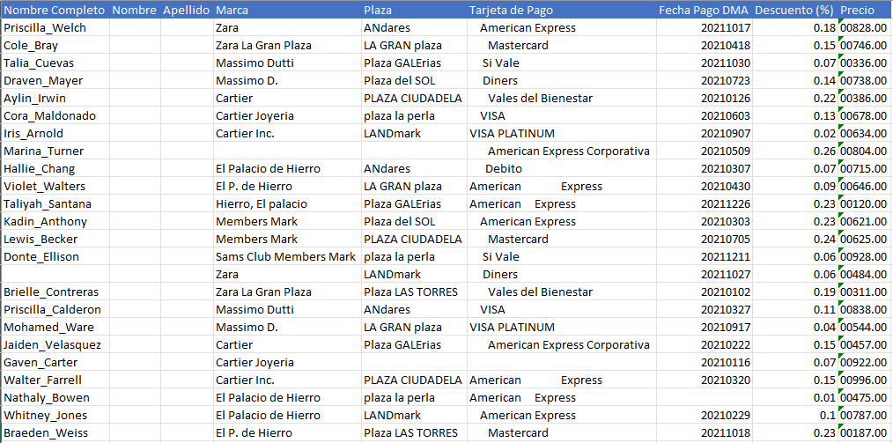

### Cuadro de Excel con cada uno de los desafios resueltos
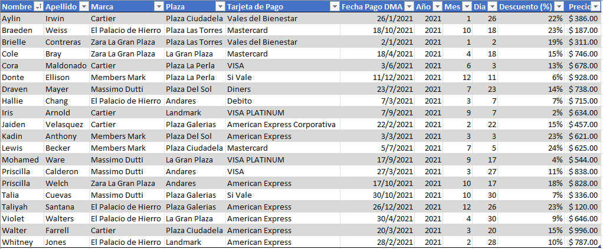

### Reto de separar Nombres y Apellidos
En el mismo proyecto pero diferentes hoja se nos presenta un Reto, en el cual consiste en Separar el nombre de los apellidos

### Cuadro de excel mostrando el Reto a realizar
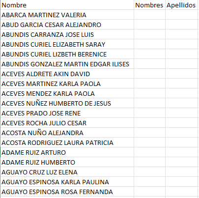

### Cuadro de excel con sus respectivas columnas con el nombre por una parte y los apellidos por otra.
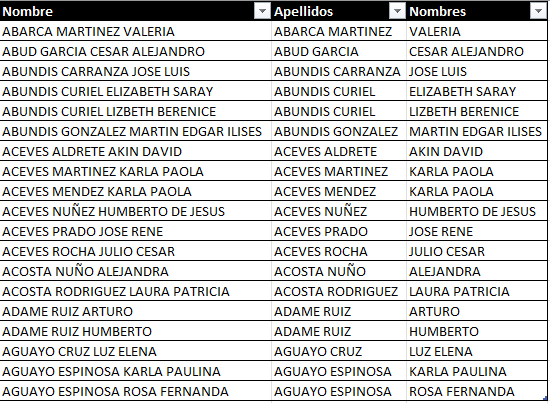

[Ver archivo completo](https://github.com/BryanTenorio/Excels-Projects/blob/4f3ae4121c73b607cbdb224fa3513f92fc1d031b/Limpieza%20Datos.xlsx)

## 2. Coleccionista de Tenis
En este proyecto se crea un dashboard interactivo para un coleccionista de tenis, visualizando datos de ventas, tendencias y análisis de inventario.

### Acerca del Dataset
- **Contexto**: Este dataset es del concurso de datos de StockX 2019.
- **Contenido**: El dataset contiene aproximadamente 10,000 ventas de zapatos de 50 modelos diferentes (Nike x Off-White y Yeezy). Las columnas originales incluyen:
  - `Order Date`, `Brand`, `Sneaker Name`, `Sale Price`, `Retail Price`, `Release Date`, `Shoe Size`, `Buyer Region`.

### Columnas Después de la Limpieza de Datos
  - `Fecha de Compra`, `Marca`, `Precio de Venta Real`, `Precio Sugerido`, `Fecha de Lanzamiento`, `Talla Zapato`, `Región de Compra`, `% Diferencial`, `Marca2`, `Modelo`, `Color`, `Diferencial en Dlls`

### Análisis Realizado con Tablas Dinámicas
- **Diferencial de Precio a lo Largo del Tiempo**: Análisis de cómo varía el precio de venta respecto al precio sugerido con el tiempo.
- **Diferencial en Dólares por Modelo**: Comparación del diferencial en dólares entre los modelos de zapatos.
- **Diferencial en Porcentaje por Modelo**: Análisis del diferencial porcentual entre los modelos.
- **Ventas por Marca**: Visualización de la cantidad de ventas por cada marca.
- **Estados con mayor % de diferencia**: Porcentaje de ventas de cada estado representado en porcentaje.

### Diferencial de precio a lo largo del tiempo
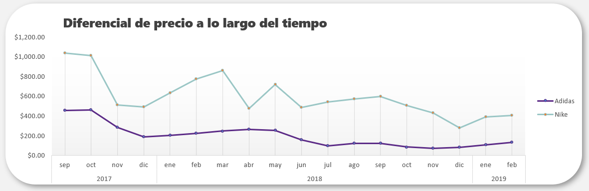

### Diferencial en dolares por modelo
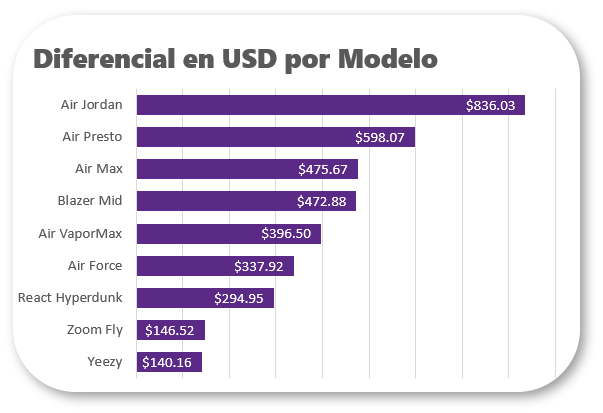

### Diferencial en porcentaje por modelo
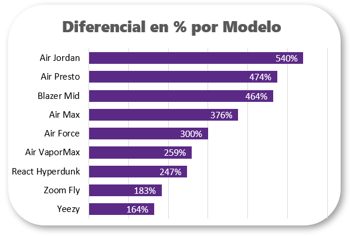

### Ventas por marca
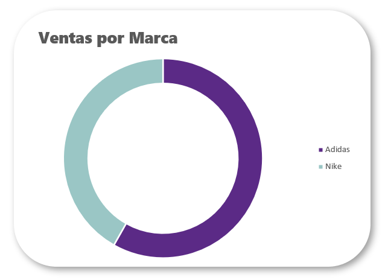

### Estados con mayor porcentaje de diferencia
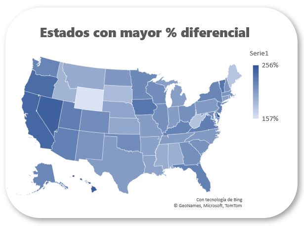

### Dashboard
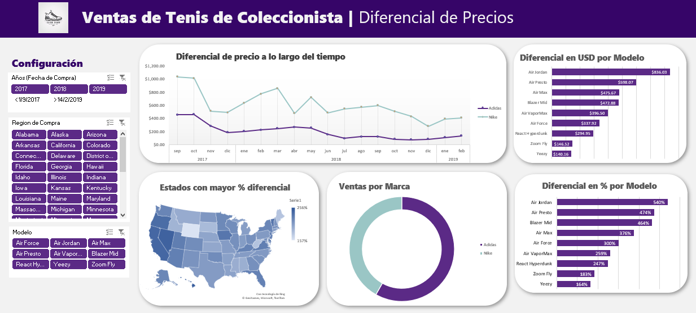

[Ver archivo completo](https://github.com/BryanTenorio/Excels-Projects/blob/4f3ae4121c73b607cbdb224fa3513f92fc1d031b/Coleccionista%20Tenis.xlsx)

### Conclusiones
Este dashboard permite identificar cuáles son los modelos más rentables y populares, y ofrece insights sobre cuándo es más rentable vender cada modelo de zapato.

## 3. Venta de Bicicletas

### Descripción del Proyecto
En este proyecto, se analiza un conjunto de datos de ventas de bicicletas para identificar patrones y tendencias en las decisiones de compra de bicicletas. Se realizó la limpieza y organización de los datos y se crearon tablas dinámicas para obtener insights valiosos.

### Columnas Iniciales del Dataset
  - `ID`, `Marital Status`, `Gender`, `Income`, `Children`, `Education`, `Occupation`, `Home Owner`, `Cars`, `Commute Distance`, `Region`, `Age`, `Purchased Bike`

### Columnas Después de la Limpieza y Organización
  - `ID`, `Estado Civil`, `Género`, `Ingresos`, `Hijos`, `Educación`, `Occupación`, `Propietario de Vivienda`, `Autos`, `Distancia de Viaje`, `Región`, `Edad`, `Rango de Edad`, `Compra de Bicicleta`

### Análisis Realizado con Tablas Dinámicas
- **Ingreso Promedio por Decisión de Compra de Bicicleta**: Análisis del ingreso promedio de los clientes en función de si compraron o no una bicicleta.
- **Distancia de Viaje por Decisión de Compra de Bicicleta**: Análisis de la distancia de viaje promedio de los clientes en función de si compraron o no una bicicleta.
- **Rango de Edad por Decisión de Compra de Bicicleta**: Análisis de la distribución de los clientes en diferentes rangos de edad en función de si compraron o no una bicicleta.
  
### Ingreso Promedio por Decisión de Compra de Bicicleta
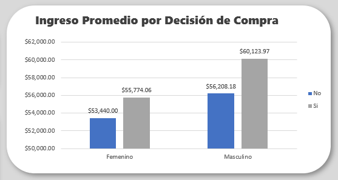

### Distancia de Viaje por Decisión de Compra de Bicicleta
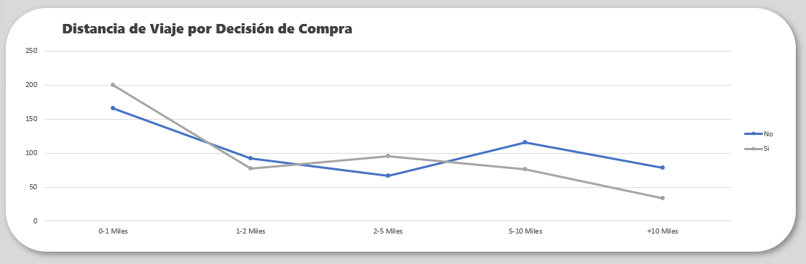

### Rango de Edad por Decisión de Compra de Bicicleta
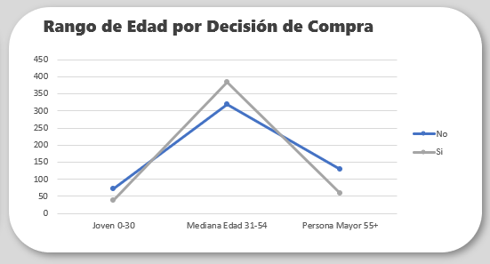

### Dashboard

### Conclusiones
El análisis realizado proporciona insights sobre cómo factores como el ingreso, la distancia de viaje y la edad influyen en la decisión de compra de bicicletas. Estos insights pueden ser útiles para dirigir las estrategias de marketing y ventas de una empresa de bicicletas.

[Ver archivo completo](https://github.com/BryanTenorio/Excels-Projects/blob/4f3ae4121c73b607cbdb224fa3513f92fc1d031b/Venta%20Bicicletas.xlsx)

## Sobre el Autor
Mi nombre es Jhon Tenorio y este repositorio es parte de mi portafolio como Analista de Datos. Aquí presento mis habilidades en Excel para la limpieza de datos, creación de dashboards y análisis de ventas. Para ver más proyectos y mi progreso en el análisis de datos, visita mi [perfil de GitHub](https://github.com/BryanTenorio).
